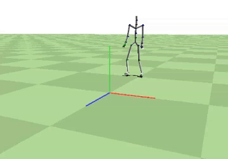

Motion Interpolation in Animation
Overview
This project focuses on implementing various interpolation techniques to animate motion sequences from motion capture data. Utilizing the AMC (Acclaim Motion Capture) format, the program interpolates joint rotations represented by Euler angles and quaternions to generate smooth and realistic animations.

Features
Euler Angle and Quaternion Representations: Implements dual support for both Euler angles and quaternion representations of joint rotations.
Linear and Bezier Interpolation in Euler Space: Applies linear and Bezier interpolation techniques to compute intermediate frames in Euler space.
Quaternion Interpolation: Incorporates Spherical Linear Interpolation (SLERP) and Bezier SLERP for quaternions, offering a smoother and more realistic motion transition.
Non-Uniform Keyframes Support: Enhances the flexibility of animation by supporting keyframes that are non-uniform in time.
Root Position Interpolation: For quaternion interpolations, the root position is interpolated using corresponding Euler interpolation techniques (Linear for Linear Quaternion, Bezier for Bezier Quaternion).
Installation
To set up the project, ensure you have the required environment which includes Node.js, Python, and C++ compilers. Follow these steps:

Clone the repository: git clone [repository-link].
Install dependencies: Navigate to the project directory and run npm install.
Build the project: npm run build (or relevant build commands for C++ components).
Running the Program
To run the program:

Place your AMC file in the designated input directory.
Run the script/command to start the interpolation process.
The output animations will be available in the specified output directory.
Usage
bash
Copy code
interpolator --input [path-to-amc-file] --output [output-directory] --interpolation [type] --keyframe-gap [N]
--input: Path to the input AMC file.
--output: Directory to save the interpolated animation.
--interpolation: Type of interpolation (linear, bezier, slerp, bezier-slerp).
--keyframe-gap: The gap N between keyframes.